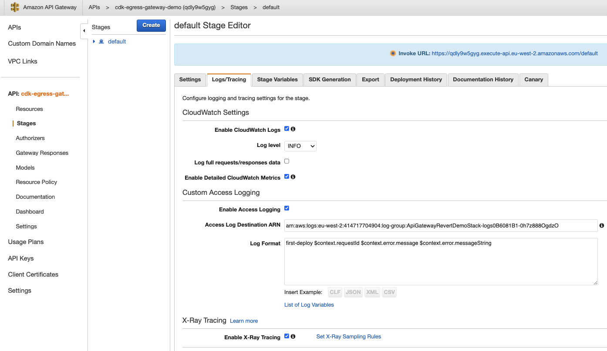
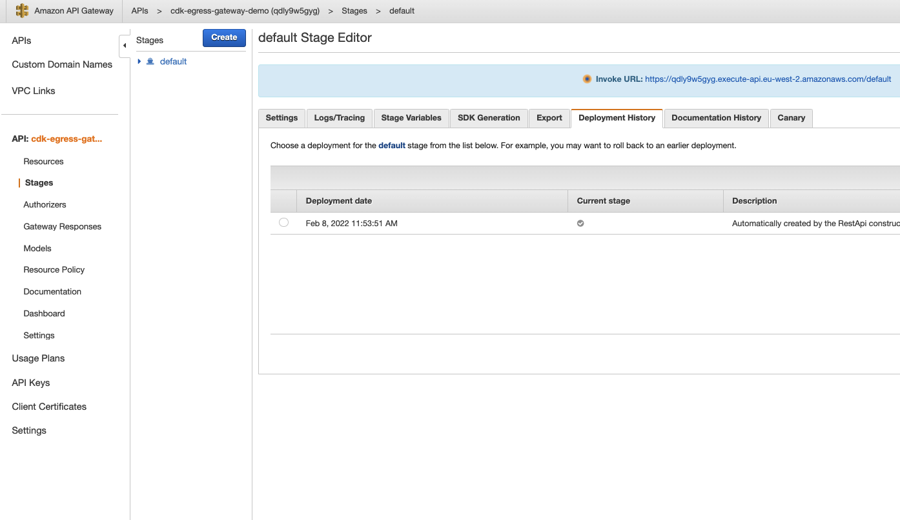
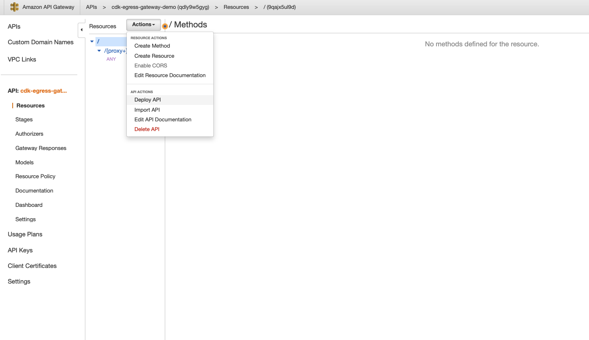
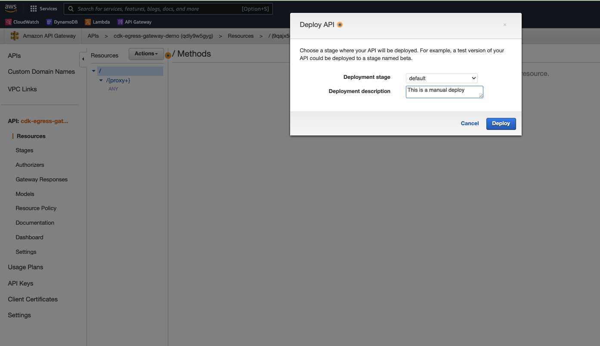
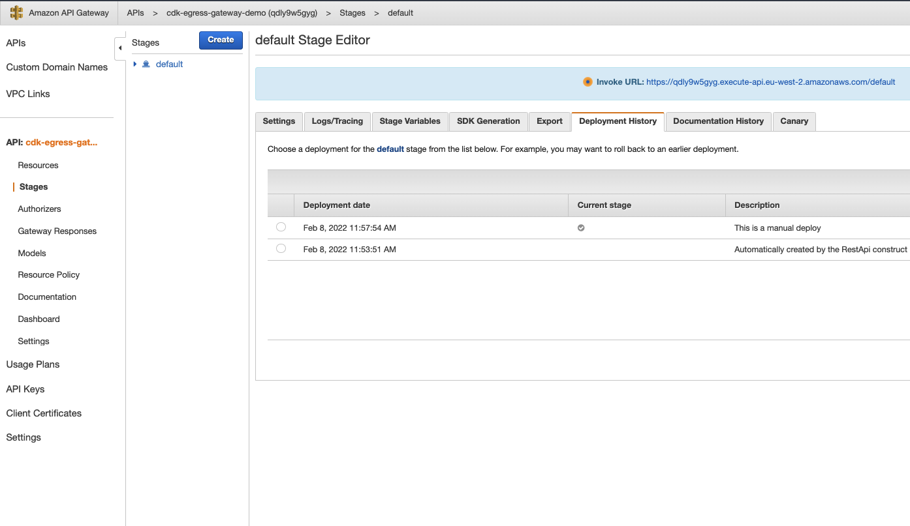
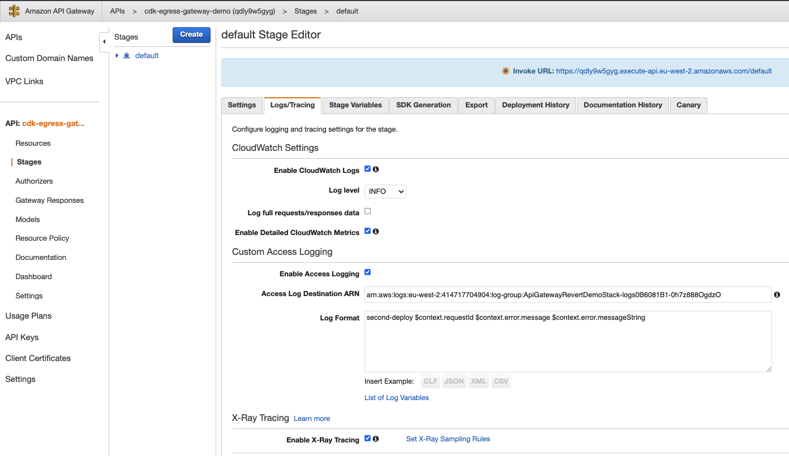
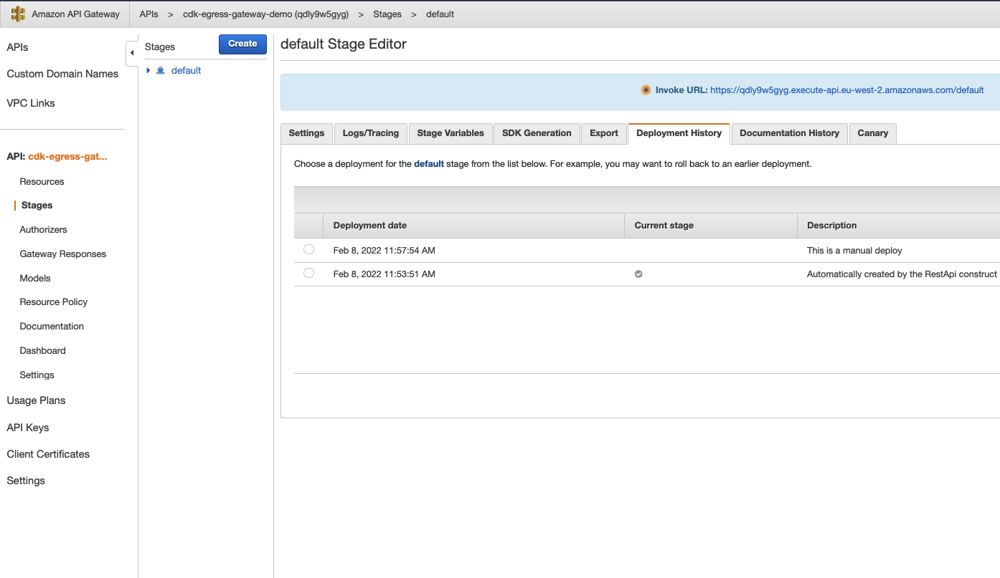

# api-gateway-revert-demo

- [api-gateway-revert-demo](#api-gateway-revert-demo)
  - [Setup](#setup)
  - [Reproduction steps](#reproduction-steps)
    - [Deploy first via cdk](#deploy-first-via-cdk)
    - [Manually deploy api-gateway in aws ui](#manually-deploy-api-gateway-in-aws-ui)
    - [Deploy again via cdk](#deploy-again-via-cdk)
  - [Diff the generated cloudformation](#diff-the-generated-cloudformation)

## Setup

```
npm i 
cdk bootstrap --profile sandbox
```

Make sure a valid aws profile is available


## Reproduction steps

### Deploy first via cdk
>The assets and cloudformation templates generated by this run of cdk can be found in `./cdk-outputs/first-deploy`

```
DEPLOY_COUNT=first-deploy cdk deploy --profile sandbox
```
> be sure to set the DEPLOY_COUNT string differently between runs

`DEPLOY_COUNT` is used to change the log format between deploys to trigger the issue

see L:37 in `./lib/api-gateway-revert-demo-stack.ts`




### Manually deploy api-gateway in aws ui




### Deploy again via cdk
The assets and cloudformation templates generated by this run of cdk can be found in `./cdk-outputs/second-deploy`

```
DEPLOY_COUNT=second-deploy cdk deploy --profile sandbox
```




## Diff the generated cloudformation
```sh
meld ./cdk-outputs/first-deploy/ApiGatewayRevertDemoStack.template.json ./cdk-outputs/second-deploy/ApiGatewayRevertDemoStack.template.json 
```